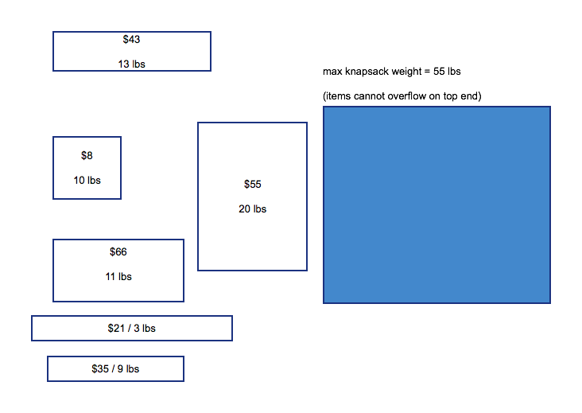
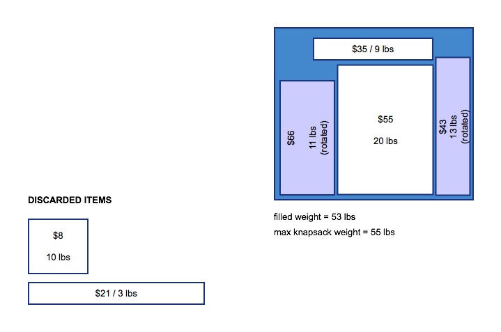

# knapsack
Find the optimal fit for items in a knapsack.
 - items may be rotated to fit better
 - best solution has highest-value combination that can fit inside while being under weight

## Illustration of Problem

#### Unfilled Knapsack

  

#### Filled-Up Knapsack

  

## General Strategy for Solution

### Begin with knapsack max properties:
- maxWeightLimit
- maxSpaceLimit

### items are represented as rectangles with these properties:
 - itemWeight
 - itemSize
 - itemValue
 - itemArea
 - pinningPosition

### For simplicity, we consider item size in 2 dimensions only (just x,y and not x,y,z)

- start with a list of items
 - check each item size and throw out ones that are larger than maxSpaceLimit

- prioritize each item condition
 - rank each item by value, descending
  - set highestValue scaled to be 100

- rank each item by weight, ascending
  - set lowestWeight scaled to be 100
  - heavier items have a negative score, scaled away from maxWeight

- rank each item by size, ascending
  - set smallestSize scaled to be 100
  - larger items have a negative score, scaled away from maxSpaceLimit

- score each item by highest value + lowest weight + smallest size
  - desired items have scores closer to 300

- with highest scored items, go through each item and:
  - make a decision tree with these branches that represent all permutations:
    - arrange & rotate item to maximize remaining space in knapsack
      - use a grid that has a pinning position for placement of each item
        - pinning position is the top-left edge of item
        - pinning position has to be inside the knapsack area
      - helper function to check all sides that they don't exceed nearby "walls" of objects/knapsack edges
    - compare combinations to see which partner items have higher value but still under maxWeightLimit